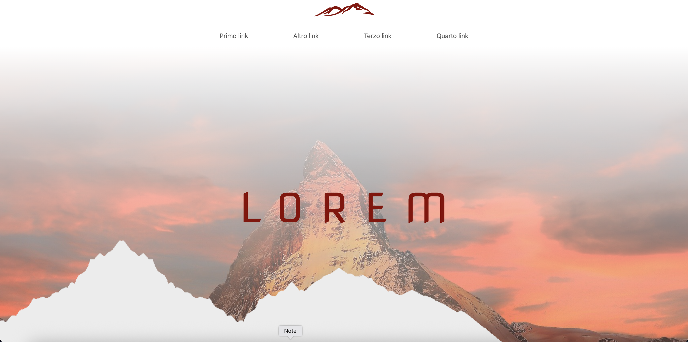

# RedProject

"RedProject" è un progetto front-end sviluppato con HTMl e CSS.
Ha per me un grande valore emotivo in quanto è il primo progetto sviluppato durante il Bootcamp di Aulab.

E' disponibile anche online tramite GitHub Pages, accedendo a [QUESTO LINK](https://leonardonotaristefano-dev.github.io/RedProject/).

## Obiettivi del Progetto
L'obiettivo era replicare un sito Web sviluppandolo utilizzando HTML,CSS e Bootstrap partendo da un Mockup.

## Tecnologie Utilizzate

 - *HTML5*
 - *CSS3*
 - *Bootstrap*

## Struttura del Progetto

Il progetto è organizzato nei seguenti file:

- **index.html**: L'unica pagina del sito che testa le capacità dello sviluppatore principalmente in termini di posizionamento degli elementi.

- **style.css**: Il file CSS che definisce lo stile del sito, inclusi i colori.

- **media/**: cartella che contiene tutte le immagini utilizzate nel sito.

## Design e Stile

Per il design, i colori presenti nel progetto sono:

- **Titoli e sfondi principali**: rgb(139, 0, 0);
- **Paragrafi**: rgb(0, 0, 0);
- **Footer**: rgb(255, 255, 255);

Il font utilizzato è:
- **Nova Square**

Il font è stato importato da Google Fonts.

## Considerazioni

Attraverso **RedProject**, ho potuto muovere i primi passi nello sviluppo web e nutrito la mia passione per questo mondo.

Per ulteriori informazioni, non esitare a contattarmi!
---